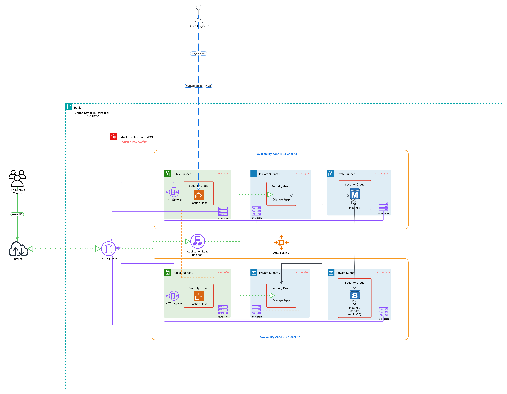

# Technical DevOps Assessment - Django Infrastructure

## Overview

This project demonstrates production-ready Infrastructure as Code (IaC) for deploying a Django application on AWS. I've implemented the solution using both Terraform and CloudFormation to showcase different approaches to infrastructure automation.

## Architecture

### AWS Architecture Diagram


### Design Decisions

**Network Segmentation**: I chose a 3-tier architecture with clear separation:
- Public subnets for internet-facing resources (ALB, Bastion)
- Private subnets for application instances (Django apps)
- Database subnets for RDS (isolated from application tier)

**High Availability**: Multi-AZ deployment across 2 availability zones with:
- Auto Scaling Group (2-3 instances, CPU-based scaling at 70%)
- RDS Multi-AZ for database failover
- Redundant NAT Gateways for outbound connectivity

**Security**: Implemented defense-in-depth with security groups following least privilege:
- ALB accepts HTTP/HTTPS from internet
- Apps only accept traffic from ALB
- Database only accepts connections from apps
- Bastion provides secure SSH access

## Quick Start

### Prerequisites
- AWS CLI configured with appropriate permissions
- Terraform 1.0+ or AWS CLI for CloudFormation
- EC2 Key Pair created in target region

### Terraform Deployment
```bash
git clone https://github.com/cognetiks/Technical_DevOps_app.git
cd Technical_DevOps_app/terraform

# Configure your settings
cp terraform.tfvars.example terraform.tfvars
# Edit terraform.tfvars with your key pair name and email

terraform init
terraform validate
terraform plan
terraform apply
```

### CloudFormation Deployment
```bash
cd Technical_DevOps_app/cloudformation

# Update parameters.json with your settings
aws cloudformation create-stack \
  --stack-name django-app-infrastructure \
  --template-body file://main-template.yaml \
  --parameters file://parameters.json \
  --capabilities CAPABILITY_IAM
```

## Configuration

### Terraform Variables
```hcl
# terraform.tfvars
aws_region = "us-east-1"
environment = "production"
key_name = "your-ec2-key-pair"
notification_email = "your-email@example.com"
```

**Advanced Configuration**: Each module includes `terraform.tfvars.example` for customizing instance types, scaling parameters, and network settings.

### Module Structure
```
terraform/
├── main.tf                 # Root orchestration
├── variables.tf            # Input variables
├── outputs.tf             # Infrastructure outputs
└── modules/
    ├── VPC/               # Network foundation
    ├── Networking/        # Security groups
    ├── ASG/              # Compute + Bastion
    ├── ALB/              # Load balancing
    ├── RDS/              # Database
    ├── S3/               # Storage
    └── cloudwatch/       # Monitoring
```

## Infrastructure Details

### Networking (10.0.0.0/16)
- **Public**: 10.0.1.0/24, 10.0.2.0/24 (ALB, Bastion)
- **Private**: 10.0.10.0/24, 10.0.11.0/24 (Django apps)
- **Database**: 10.0.20.0/24, 10.0.21.0/24 (RDS Multi-AZ)

### Compute
- **Instances**: Ubuntu 22.04 LTS with automated Django deployment
- **Scaling**: Target tracking at 70% CPU utilization
- **Load Balancer**: ALB with health checks on `/`

### Database
- **Engine**: PostgreSQL 16.4 (Multi-AZ enabled)
- **Instance**: db.t3.micro with 100GB storage
- **Backup**: 7-day retention, automated maintenance windows

### Monitoring
- CloudWatch alarms for CPU and scaling events
- SNS email notifications for critical alerts
- SSM Parameter Store for configuration management

## Testing & Validation

### Application Access
```bash
# Get ALB endpoint
terraform output alb_dns_name

# Test application
curl -I http://<alb-dns-name>/
```

### Infrastructure Health
```bash
# Check target group health
aws elbv2 describe-target-health --target-group-arn <arn>

# Monitor Auto Scaling
aws autoscaling describe-auto-scaling-groups --auto-scaling-group-names <name>
```

### Troubleshooting
Common issues I've encountered and solutions:
1. **Instances not registering**: Check security groups allow ALB → App communication
2. **Database connectivity**: Verify RDS security group allows app access on port 5432
3. **SSH access**: Ensure key pair exists and bastion security group allows your IP

## Design Considerations

### What I Implemented
- **Modular Terraform**: Reusable modules for different environments
- **Security Best Practices**: Least privilege access, network segmentation
- **High Availability**: Multi-AZ deployment with automated failover
- **Monitoring**: Comprehensive CloudWatch integration
- **Cost Optimization**: Right-sized instances for development workloads

### Production Improvements
For a production deployment, I would recommend:
- AWS Secrets Manager for database credentials
- VPC Flow Logs for network monitoring
- RDS encryption at rest
- WAF protection for the ALB
- Systems Manager Session Manager instead of bastion hosts
- Container deployment with ECS/Fargate for better scalability

### Cost Considerations
Current monthly estimate: ~$109 (2x t2.micro EC2, db.t3.micro Multi-AZ, ALB, 2x NAT Gateways)

## Cleanup
```bash
# Terraform
terraform destroy

# CloudFormation
aws cloudformation delete-stack --stack-name django-app-infrastructure
```

## Kubernetes Deployment (EKS)

### Prerequisites for EKS
- Docker installed locally
- kubectl configured
- eksctl or AWS CLI with EKS permissions
- Helm 3.x (optional but recommended)

### EKS Cluster Setup
```bash
# Create EKS cluster
eksctl create cluster --name django-app --region us-east-1 --nodegroup-name django-workers --node-type t3.medium --nodes 2 --nodes-min 1 --nodes-max 2 --managed
```

### Docker Containerization
```bash
# Build Django application image
docker build -t django-app:latest .

# Tag and push to Docker Hub
docker login
docker tag django-app:latest <your-dockerhub-username>/django-app:latest
docker push <your-dockerhub-username>/django-app:latest
```

### Kubernetes Deployment
```bash
# Deploy application using manifests
kubectl apply -f kubernetes/manifests/

# Or using Helm (recommended)
helm install django-app kubernetes/helm/django-app/

# Verify deployment
kubectl get pods,svc,hpa -n django-app
```

### Kubernetes Resources Structure
```
kubernetes/
├── manifests/
│   ├── namespace.yaml          # Django app namespace
│   ├── configmap.yaml          # Application configuration
│   ├── secret.yaml             # Database credentials
│   ├── deployment.yaml         # Django app deployment
│   ├── service.yaml            # ClusterIP service
│   ├── ingress.yaml            # ALB ingress controller
│   └── hpa.yaml                # Horizontal Pod Autoscaler
├── helm/
│   └── django-app/             # Helm chart
└── monitoring/
    ├── prometheus/             # Prometheus configuration
    └── grafana/                # Grafana dashboards
```

### Monitoring Setup
```bash
# Deploy Prometheus and Grafana using manifests
kubectl apply -f kubernetes/monitoring/

# Verify monitoring stack deployment
kubectl get pods -n monitoring

# Access Grafana
kubectl port-forward -n monitoring svc/grafana 3000:3000
# Default credentials: admin/admin
```

### Grafana Dashboards

#### Application Performance Dashboard


*Metrics: Request rate, response time, error rate, active connections*

#### Infrastructure Metrics Dashboard


*Metrics: CPU utilization, memory usage, network I/O, pod scaling events*

#### Database Performance Dashboard


*Metrics: Connection count, query performance, database size, replication lag*

### Scaling and High Availability
```bash
# Check HPA status
kubectl get hpa django-app -n django-app

# Manual scaling (if needed)
kubectl scale deployment django-app --replicas=5 -n django-app

# View scaling events
kubectl describe hpa django-app -n django-app
```

### Application Access
```bash
# Get ALB endpoint
kubectl get ingress django-app-ingress -n django-app

# Test application
curl -I http://<alb-endpoint>/
```

### Troubleshooting EKS
```bash
# Check pod logs
kubectl logs -f deployment/django-app -n django-app

# Debug pod issues
kubectl describe pod <pod-name> -n django-app

# Check cluster nodes
kubectl get nodes -o wide

# Monitor resource usage
kubectl top pods -n django-app
```

## Assessment Notes

This implementation demonstrates:
- **IaC Best Practices**: Modular, reusable, version-controlled infrastructure
- **AWS Expertise**: Multi-service integration with proper networking and security
- **Kubernetes Administration**: Container orchestration, scaling, and monitoring
- **DevOps Pipeline**: Docker containerization, Helm packaging, CI/CD readiness
- **Operational Readiness**: Monitoring, logging, and troubleshooting capabilities
- **Documentation**: Clear instructions for deployment and maintenance

Thank you for reviewing my Technical DevOps assessment. I look forward to your feedback!